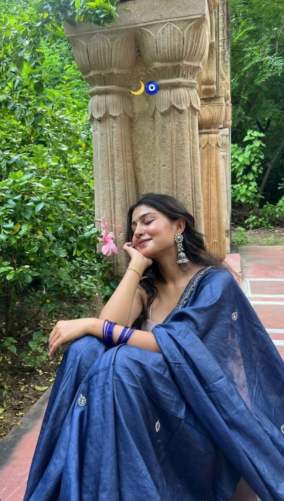

# 🇮🇳 Indian Girls Pictures — Curated Image Collection

<p align="center">
  
  
  
  
  
  
  
  
</p>

<p align="center">
  <b>A beautiful, open-source gallery of 853 high-quality images across 11 typed folders</b><br/>
  Organized by picture type — perfect for UI placeholders, mood boards & ML sample data.
</p>

<p align="center">
  <a href="https://github.com/girishlade111/indian-girls-pictures">⭐ Star this repo</a> •
  <a href="#-quick-start">Quick Start</a> •
  <a href="#-folder-organization">Folders</a> •
  <a href="#-gallery-preview">Preview</a> •
  <a href="#-usage">Usage</a>
</p>

> **v2.1 Reorg (2026-09-08):** All 853 images moved from root into **11 categorized folders** (8 original JPG folders + 3 new: `PNG_Cute_DP`, `HEIC_Collection`, `JPEG_Collection`). Update CDN URLs: `.../main/saree.jpg` → `.../main/Saree_Traditional/saree.jpg`. See [Folder Organization](#-3-folder-organization).

---

## 📑 Table of Contents

- [1. About](#-1-about)
- [2. Highlights](#-2-highlights)
- [3. Folder Organization](#-3-folder-organization)
- [4. Gallery Preview](#-4-gallery-preview)
- [5. Repository Stats](#-5-repository-stats)
- [6. Quick Start](#-6-quick-start)
- [7. Installation](#-7-installation)
- [8. Usage](#-8-usage)
- [9. CDN & API Reference](#-9-cdn--api-reference)
- [10. Project Structure](#-10-project-structure)
- [11. Configuration (.gitignore)](#-11-configuration-gitignore)
- [12. Development Setup](#-12-development-setup)
- [13. Image Optimization](#-13-image-optimization)
- [14. Deployment](#-14-deployment)
- [15. CI/CD](#-15-cicd-github-actions)
- [16. Contributing](#-16-contributing)
- [17. Roadmap](#-17-roadmap)
- [18. Changelog](#-18-changelog)
- [19. FAQ](#-19-faq)
- [20. Troubleshooting](#-20-troubleshooting)
- [21. Security](#-21-security)
- [22. License](#-22-license)
- [23. Disclaimer](#-23-disclaimer)
- [24. Contact & Credits](#-24-contact--credits)

---

## 📖 1. About

**indian-girls-pictures** now hosts **853 images (~245.73 MB)** across **11 typed folders** — expanded from 736 JPGs to include PNG, HEIC, JPEG and mixed formats. Every file was reorganized via `git mv` so history is preserved (100% rename detection).

**Why folders?** With 800+ images, flat root was unmanageable. Typed folders give:

- Faster GitHub browsing (folder navigation, scoped search)
- Cleaner CDN URLs (`.../Saree_Traditional/saree.jpg` vs root soup)
- Selective imports: need only portraits? Import `Portrait_DP` or `PNG_Cute_DP`
- Better PR reviews (scoped diffs) and `git log --follow` per file

**Use cases:**

| Use Case | Example |
|----------|---------|
| **Frontend placeholders** | React / Next.js / Vue / Angular / Svelte / Flutter |
| **Design** | Figma mood boards, Dribbble shots, hero images |
| **E-commerce mock** | Fashion lookbook, kurta/saree store, cart previews |
| **Social apps** | Avatar / DP dataset, feed mock |
| **ML / CV** | Face detection, compression, lazy-loading pipelines |
| **Education** | HTML/CSS `img` demos, responsive images |

> Served via GitHub Raw / jsDelivr CDN — clone once or use CDN zero-clone.

---

## ✨ 2. Highlights

- **853 images** — 11 folders, fully typed
- **Zero dependencies** — static images only
- **CDN-ready** — `raw.githubusercontent.com` & `cdn.jsdelivr.net` with folder paths
- **Developer-friendly** — `.gitignore` with `node_modules/`, `*.zip`, `dist/`, `.env`
- **Git history preserved** — 100% rename detection via `git mv`
- **Deploy anywhere** — GitHub Pages, Vercel, Netlify, Cloudflare Pages
- **Production-minded** — CI, optimization, security, license

---

## 📁 3. Folder Organization

All 853 images grouped by **picture type** (filename keywords + format).

| Folder | Count | Size | Type | Example Files |
|--------|-------|------|------|---------------|
| **`Saree_Traditional/`** | 4 | 0.61 MB | JPG Saree / temple / onam | `saree.jpg`, `SAREE (1).jpg`, `saari look, ethnic, temple, onam.jpg` |
| **`Kurta_Lehenga_Ethnic/`** | 8 | 0.96 MB | JPG Kurta / Lehenga / ethnic | `Traditional Printed Dasi Kurti Outfit.jpg`, `Buy pretty pink ready to wear lehenga.jpg` |
| **`Streetwear_Casual/`** | 3 | 0.18 MB | JPG Streetwear / desicore | `Colorful Streetwear Outfit.jpg`, `Desicore.jpg` |
| **`Portrait_DP/`** | 20 | 1.62 MB | JPG Portrait / DP / cute girl | `Female Dp For Insta.jpg`, `Beautiful cute girl.jpg`, `Face Snap.jpg` |
| **`Aesthetic_Soft_Girl/`** | 15 | 1.58 MB | JPG Aesthetic / soft girl | `Soft Aesthetic Indian Look ...`, `aesthetic desi outfit inspo.jpg`, `🌸...#fyp #instagood.` |
| **`Pose_Mirror_Party/`** | 6 | 0.49 MB | JPG Mirror / pose / party | `Mirrorrrii.jpg`, `Single Pic Pose Ideas.jpg`, `Pinky girls ...`, `Waffle cafe party wear ...` |
| **`Unsplash_HighRes/`** | 6 | 16.36 MB | JPG High-res Unsplash (3–4 MB each) | `dhruv-vishwakarma-...-unsplash.jpg` (4.1 MB) |
| **`General_Collection/`** | 677 | 131.04 MB | JPG ID-named bulk (hex/numeric) | `00503841e186af...jpg`, `1003176885768582369.jpg` |
| **`PNG_Cute_DP/`** | 74 | 85.48 MB | PNG + 1 WEBP — cute DP variants | `cute-dp-for-girls-1.png`, `indian-cute-girl-dp.png`, `cute-girls-profile-image-for-dp-1.webp` |
| **`HEIC_Collection/`** | 32 | 7.19 MB | HEIC — modern iPhone captures | `ayuushi_panda-20260909-0001.heic`, `_.shh._rana05-...heic` |
| **`JPEG_Collection/`** | 8 | 0.22 MB | JPEG — generic `images*.jpeg` | `images.jpeg`, `images (1).jpeg` |
| **Total** | **853** | **245.73 MB** | — | — |

**How types were decided (case-insensitive keyword rules):**

```
unsplash → Unsplash_HighRes
saree|saari|maharashtrian → Saree_Traditional
kurta|kurti|lehenga|ethnic → Kurta_Lehenga_Ethnic
streetwear|desicore|alt indian fashion → Streetwear_Casual
aesthetic|soft girl|natural glow|twirling|wrapped → Aesthetic_Soft_Girl
pose|mirrorrrii|waffle cafe|party|date night|pinky girls → Pose_Mirror_Party
portrait|face snap|cute girl|girl dp|beautiful|female dp → Portrait_DP
*.png → PNG_Cute_DP
*.heic → HEIC_Collection
*.jpeg → JPEG_Collection
fallback (677 ID-named) → General_Collection
```

All moves used `git mv` — `git log --follow -- <file>` works.

---

## 🖼️ 4. Gallery Preview

> Updated for v2.1 folder layout. All previews render on GitHub.

### Saree & Traditional

| Preview | File |
|---------|------|
|  | `Saree_Traditional/saree.jpg` |
|  | `Saree_Traditional/SAREE (1).jpg` |

### Streetwear & Kurta

| Preview | File |
|---------|------|
|  | `Streetwear_Casual/Colorful Streetwear Outfit.jpg` |
|  | `Kurta_Lehenga_Ethnic/Traditional Printed Dasi Kurti Outfit.jpg` |

### Portrait & Aesthetic

| Preview | File | Preview | File |
|---------|------|---------|------|
|  | `Portrait_DP/Female Dp For Insta.jpg` |  | `PNG_Cute_DP/cute-dp-for-girls-1.png` |
|  | `Portrait_DP/Face Snap.jpg` |  | `Aesthetic_Soft_Girl/Soft Pink Traditional Beauty.jpg` |

### Pose & Unsplash & HEIC

| Preview | File | Preview | File |
|---------|------|---------|------|
|  | `Pose_Mirror_Party/Single Pic Pose Ideas.jpg` |  | `Unsplash_HighRes/dhruv-vishwakarma-...-unsplash.jpg` |
|  | `JPEG_Collection/images.jpeg` |  | `HEIC_Collection/ayuushi_panda-...heic` *(heic preview may not render — use JPG/PNG for web)* |

*Tip: Click any folder on GitHub → open image → **Raw** → copy URL.*

---

## 📊 5. Repository Stats

| Metric | Value |
|--------|-------|
| **Total images** | **853** |
| **Total size (recursive)** | **245.73 MB** |
| **Folders** | **11 typed folders** |
| **Formats** | JPG 677 + PNG 74 + HEIC 32 + JPEG 8 + WEBP 1 + extras 3 (in Pose/Aesthetic) — see table |
| **Average size** | ~295 KB overall (skewed by PNG 85 MB & Unsplash 16 MB); median ~90 KB for JPG |
| **Largest file** | `Unsplash_HighRes/dhruv-vishwakarma-IEIP31UEy6A-unsplash.jpg` — 4.12 MB |
| **Smallest file** | `General_Collection/1127096244295199739.jpg` — 14.4 KB |
| **Largest folder** | `General_Collection` — 677 files / 131.04 MB |
| **Smallest folder** | `Streetwear_Casual` — 3 files / 0.18 MB |
| **Branch** | `main` |
| **.gitignore** | `node_modules/`, `*.zip`, `dist/`, `.env`, `.DS_Store` |

**Per-folder breakdown:** See Folder Organization table.

**Commands:**

```bash
# Count total (recursive, all image types)
Get-ChildItem -Recurse -File | Where-Object { $_.Extension -notin @(".gitignore",".md",".zip") } | Measure-Object

# Size per folder
Get-ChildItem -Directory | ForEach-Object {
  "$($_.Name): $([math]::Round(((Get-ChildItem -Recurse $_.FullName -File | Measure-Object Length -Sum).Sum)/1MB,2)) MB"
}

# Largest
Get-ChildItem -Recurse -File | Sort-Object Length -Descending | Select-Object -First 5 Name, Length
```

---

## 🚀 6. Quick Start

### 1) Clone

```bash
git clone https://github.com/girishlade111/indian-girls-pictures.git
cd indian-girls-pictures
ls -1  # 11 folders
# Aesthetic_Soft_Girl  General_Collection  HEIC_Collection  JPEG_Collection  ...
```

### 2) Browse locally

```bash
open Saree_Traditional/saree.jpg          # macOS
start Saree_Traditional\saree.jpg        # Windows
xdg-open Portrait_DP/Face\ Snap.jpg       # Linux
```

### 3) CDN — zero clone (recommended)

```bash
# GitHub Raw
https://raw.githubusercontent.com/girishlade111/indian-girls-pictures/main/Saree_Traditional/saree.jpg

# jsDelivr CDN (cached, recommended)
https://cdn.jsdelivr.net/gh/girishlade111/indian-girls-pictures@main/Saree_Traditional/saree.jpg
https://cdn.jsdelivr.net/gh/girishlade111/indian-girls-pictures@main/PNG_Cute_DP/cute-dp-for-girls-1.png
https://cdn.jsdelivr.net/gh/girishlade111/indian-girls-pictures@main/Portrait_DP/Female%20Dp%20For%20Insta.jpg
https://cdn.jsdelivr.net/gh/girishlade111/indian-girls-pictures@main/HEIC_Collection/ayuushi_panda-20260909-0001.heic

# Pin to commit (immutable)
https://cdn.jsdelivr.net/gh/girishlade111/indian-girls-pictures@81955fd/PNG_Cute_DP/cute-dp-for-girls-1.png
```

### Migration from Root (v1.x → v2.1)

```
Old: .../main/saree.jpg                                → New: .../main/Saree_Traditional/saree.jpg
Old: .../main/Female%20Dp%20For%20Insta.jpg             → New: .../main/Portrait_DP/Female%20Dp%20For%20Insta.jpg
Old: .../main/cute-dp-for-girls-1.png                   → New: .../main/PNG_Cute_DP/cute-dp-for-girls-1.png
Old: .../main/*.jpg (general IDs)                      → New: .../main/General_Collection/<file>
Old: .../main/ayuushi_panda-20260909-0001.heic          → New: .../main/HEIC_Collection/ayuushi_panda-20260909-0001.heic
```

JS helper to remap:

```javascript
const v1ToV2 = (filename) => {
  const map = {
    'saree.jpg': 'Saree_Traditional/saree.jpg',
    'Colorful Streetwear Outfit.jpg': 'Streetwear_Casual/Colorful Streetwear Outfit.jpg',
    'cute-dp-for-girls-1.png': 'PNG_Cute_DP/cute-dp-for-girls-1.png'
  };
  return map[filename] || `General_Collection/${filename}`;
};
```

---

## 📦 7. Installation

| Level | What you do | When |
|-------|-------------|------|
| **A. Static** | Clone and copy needed folders | Simple HTML, Figma, local demo |
| **B. CDN** | Use jsDelivr URLs directly | Production web apps (no repo bloat) |
| **C. NPM wrapper** | `npm init -y` + import via `public/` | Next.js / Vite / Astro gallery |
| **D. Submodule** | `git submodule add ...` | Share assets across repos |

**A. Static copy (selective):**

```bash
git clone https://github.com/girishlade111/indian-girls-pictures.git
cp -r indian-girls-pictures/Saree_Traditional ./my-app/public/images/
cp -r indian-girls-pictures/PNG_Cute_DP ./my-app/public/images/
# HEIC not ideal for web — convert to JPG/PNG first
```

**B. CDN:** See Quick Start → CDN.

**C. As NPM-based gallery:**

```bash
npm init -y
npm install vite  # or next, astro
mkdir -p public
cp -r ../indian-girls-pictures/Saree_Traditional ./public/
npm run dev
```

**D. Git submodule:**

```bash
git submodule add https://github.com/girishlade111/indian-girls-pictures.git assets/gallery
git commit -m "Add gallery as submodule"
```

---

## 💻 8. Usage

### HTML

```html
<!-- Local (with folders) -->


<!-- CDN -->


<!-- HEIC: convert to JPG for web, or use PNG fallback -->
<!-- HEIC not supported in most browsers — serve JPG/PNG instead -->
```

### CSS

```css
.hero {
  background-image: url('https://cdn.jsdelivr.net/gh/girishlade111/indian-girls-pictures@main/Saree_Traditional/saree.jpg');
  background-size: cover;
  background-position: center;
  aspect-ratio: 3 / 4;
}
```

### JavaScript — Random per Folder

```javascript
const CDN = 'https://cdn.jsdelivr.net/gh/girishlade111/indian-girls-pictures@main/';
const folders = {
  saree: 'Saree_Traditional',
  portrait: 'Portrait_DP',
  png: 'PNG_Cute_DP',
  general: 'General_Collection'
};

export const randomFrom = (folderKey) => {
  const samples = {
    saree: ['saree.jpg', 'SAREE (1).jpg'],
    portrait: ['Female Dp For Insta.jpg', 'Beautiful cute girl.jpg'],
    png: ['cute-dp-for-girls-1.png', 'indian-cute-girl-dp.png']
  };
  const list = samples[folderKey] || samples.portrait;
  const file = list[Math.floor(Math.random()*list.length)];
  return CDN + folders[folderKey] + '/' + encodeURIComponent(file);
};

document.querySelector('#hero').src = randomFrom('png');
```

### React

```jsx
export function Avatar({ file = 'Female Dp For Insta.jpg' }) {
  return (
    
  );
}
export function PngGallery() {
  return (
    <div className="grid grid-cols-3 gap-4">
      {['cute-dp-for-girls-1.png', 'indian-cute-girl-dp.png'].map(f => (
        
      ))}
    </div>
  );
}
```

### Next.js

```jsx
import Image from 'next/image';
export default function Gallery() {
  return (
    <div className="grid grid-cols-3 gap-4">
      <Image src="/Saree_Traditional/saree.jpg" alt="Saree" width={400} height={600} />
      <Image src="https://cdn.jsdelivr.net/gh/girishlade111/indian-girls-pictures@main/PNG_Cute_DP/cute-dp-for-girls-1.png" alt="PNG" width={400} height={600} unoptimized />
    </div>
  );
}
// next.config.js: images: { remotePatterns: [{ hostname: 'cdn.jsdelivr.net' }] }
```

### Python (Pillow — iterate folders)

```python
from pathlib import Path
from PIL import Image
root = Path('.')
for folder in ['Saree_Traditional', 'Portrait_DP', 'PNG_Cute_DP', 'HEIC_Collection']:
    imgs = list((root / folder).glob('*.*'))
    print(f'{folder}: {len(imgs)} images, {[p.suffix for p in imgs[:2]]}')
```

### Generate JSON Index (per folder)

```javascript
// scripts/generate-index.js
import { readdir, writeFile } from 'fs/promises';
const folders = ['Saree_Traditional','Kurta_Lehenga_Ethnic','Streetwear_Casual','Portrait_DP','Aesthetic_Soft_Girl','Pose_Mirror_Party','Unsplash_HighRes','General_Collection','PNG_Cute_DP','HEIC_Collection','JPEG_Collection'];
const index = {};
for (const f of folders) {
  index[f] = (await readdir(f)).filter(x => !x.startsWith('.'));
}
await writeFile('index.json', JSON.stringify(index, null, 2));
console.log(`Wrote index.json: ${Object.values(index).flat().length} files`);
// Fetch: https://cdn.jsdelivr.net/gh/girishlade111/indian-girls-pictures@main/index.json
```

---

## 🌐 9. CDN & API Reference

| Provider | URL Pattern | Cache | Best For |
|----------|-------------|-------|----------|
| **GitHub Raw** | `https://raw.githubusercontent.com/girishlade111/indian-girls-pictures/main/<Folder>/<file>` | None | Debug |
| **jsDelivr** | `https://cdn.jsdelivr.net/gh/girishlade111/indian-girls-pictures@main/<Folder>/<file>` | Global ~24h | Production |
| **jsDelivr @ commit** | `https://cdn.jsdelivr.net/gh/girishlade111/indian-girls-pictures@<sha>/<Folder>/<file>` | Immutable | Lock version |
| **GitHub Pages** | `https://girishlade111.github.io/indian-girls-pictures/<Folder>/<file>` | GitHub CDN | Static site |

**Examples:**

```
Saree:   .../Saree_Traditional/saree.jpg
PNG:     .../PNG_Cute_DP/cute-dp-for-girls-1.png
HEIC:    .../HEIC_Collection/ayuushi_panda-20260909-0001.heic
JPEG:    .../JPEG_Collection/images.jpeg
General: .../General_Collection/1003176885768582369.jpg
```

**Note:** HEIC is not browser-native — convert to JPG/PNG for web use.

---

## 📂 10. Project Structure

```
indian-girls-pictures/
├── .git/                         # Git history
├── .gitignore                    # node_modules/, *.zip, dist/, .env, .DS_Store
├── README.md                     # You are here (v2.1 — 11 folders)
├── Saree_Traditional/            # 4 files, 0.61 MB
├── Kurta_Lehenga_Ethnic/         # 8 files, 0.96 MB
├── Streetwear_Casual/            # 3 files, 0.18 MB
├── Portrait_DP/                  # 20 files, 1.62 MB
├── Aesthetic_Soft_Girl/          # 15 files, 1.58 MB
├── Pose_Mirror_Party/            # 6 files, 0.49 MB
├── Unsplash_HighRes/             # 6 files, 16.36 MB
├── General_Collection/           # 677 files, 131.04 MB
├── PNG_Cute_DP/                  # 74 files, 85.48 MB (PNG + 1 WEBP)
├── HEIC_Collection/              # 32 files, 7.19 MB
└── JPEG_Collection/              # 8 files, 0.22 MB
    └── images.jpeg ...
# + future: thumbnails/, index.json, .github/workflows/optimize.yml
```

**Root clean:** Only `.gitignore`, `README.md`, and 11 folders (no loose images; `indian girls pictures.zip` is ignored via `*.zip`).

---

## ⚙️ 11. Configuration (.gitignore)

```gitignore
node_modules/
*.zip *.rar *.7z
dist/ build/ .next/ .nuxt/
.env .env.local
.DS_Store Thumbs.db
logs/ *.log
```

**Verify:**

```bash
cat .gitignore
git check-ignore -v node_modules/test.js  # → node_modules/
git check-ignore -v "test.zip"           # → *.zip
git check-ignore -v "test.heic"          # → (not ignored, tracked)
```

---

## 🛠️ 12. Development Setup

**Static only:**

```bash
git clone https://github.com/girishlade111/indian-girls-pictures.git
```

**As gallery web app:**

```bash
git clone https://github.com/girishlade111/indian-girls-pictures.git
cd indian-girls-pictures
npm init -y
npm install vite  # or next, astro
npm run dev
```

> `node_modules/` ignored via `.gitignore:1`.

**Python venv:**

```bash
python -m venv .venv
source .venv/bin/activate
pip install Pillow
```

---

## 🖼️ 13. Image Optimization

| Rule | Target |
|------|--------|
| Per-file | < 500 KB (Unsplash/PNG exception — PNGs average 1.1 MB, consider WebP) |
| Dimensions | Long edge 1080–1600px |
| Naming | ASCII, Title Case |
| Rights | Only own/licensed |

**Sharp (Node) — per folder:**

```bash
for dir in */; do
  for f in "$dir"/*.jpg "$dir"/*.png; do
    [ -f "$f" ] && npx sharp -i "$f" -o "$f" --quality 80 --resize 1600 && echo "Optimized $f"
  done
done

# HEIC → JPG for web
for f in HEIC_Collection/*.heic; do
  npx sharp -i "$f" -o "${f%.heic}.jpg" --quality 80
done
```

**Frontend:**

```html

```

---

## 🌐 14. Deployment

### GitHub Pages

```bash
git checkout -b gh-pages
git push origin gh-pages
# Settings → Pages → Source: gh-pages / root
# → https://girishlade111.github.io/indian-girls-pictures/Saree_Traditional/saree.jpg
```

### Vercel / Netlify

1. Import `girishlade111/indian-girls-pictures` → Framework: **Other** (static)
2. Deploy — each folder at `https://<project>.vercel.app/Saree_Traditional/saree.jpg`

### Cloudflare

```bash
npx wrangler pages deploy . --project-name=indian-girls-pictures
```

---

## ⚙️ 15. CI/CD

`.github/workflows/optimize.yml`:

```yaml
name: Optimize Images
on:
  pull_request:
    paths: ['**.jpg', '**.png', '**.heic', '**.jpeg']
jobs:
  optimize:
    runs-on: ubuntu-latest
    steps:
      - uses: actions/checkout@v4
      - uses: actions/setup-node@v4
        with: { node-version: 20 }
      - run: npm install -g sharp-cli
      - run: |
          for dir in */; do
            for f in "$dir"/*.jpg "$dir"/*.png; do
              [ -f "$f" ] && npx sharp -i "$f" -o "$f" --quality 80 --resize 1600
            done
          done
      - uses: stefanzweifel/git-auto-commit-action@v5
        with: { commit_message: "chore: auto-optimize images" }
```

---

## 🤝 16. Contributing

1. Fork → 2. Branch → 3. Add to correct folder → 4. PR

```bash
git clone https://github.com/<you>/indian-girls-pictures.git
cd indian-girls-pictures
git checkout -b add-saree-collection
cp ~/Downloads/new-saree.jpg Saree_Traditional/
npx sharp -i Saree_Traditional/new-saree.jpg -o Saree_Traditional/new-saree.jpg --quality 80 --resize 1600
git add Saree_Traditional/
git commit -m "feat: add 5 saree looks to Saree_Traditional"
git push origin add-saree-collection
```

**Checklist:**

- [ ] Correct folder (see table)
- [ ] <500 KB (PNG may be larger — consider WebP)
- [ ] No `node_modules/` or `*.zip`
- [ ] Licensed / owned

---

## 🗺️ 17. Roadmap

- [x] Public repo + `.gitignore` (`node_modules/`, `*.zip`)
- [x] 11 typed folders (853 images) via `git mv`
- [x] Detailed README v2.1 with folder docs (11 folders, 245.73 MB)
- [ ] `index.json` per-folder file list
- [ ] `thumbnails/` WebP (200/400/800) — especially for PNG_Cute_DP (85 MB)
- [ ] Gallery viewer with search & tags
- [ ] GitHub Action auto-optimize (including HEIC → JPG)
- [ ] `tags.json`
- [ ] Git LFS if total > 1 GB (currently 245 MB)

---

## 📝 18. Changelog

### 2026-09-08 — v2.1.0

- **Added 3 folders:** `PNG_Cute_DP` (74 files, 85.48 MB), `HEIC_Collection` (32 files, 7.19 MB), `JPEG_Collection` (8 files, 0.22 MB)
- **Moved remaining 117 images** (png/heic/jpeg + 3 weird) — total now **853 images in 11 folders, 245.73 MB**
- README v2.1: updated badges (853 / 245.73 MB / 11 folders), folder table expanded to 11 rows, stats per folder, new PNG/HEIC/JPEG sections, updated CDN examples with new folders, updated project structure, notes on HEIC browser support

### 2026-09-08 — v2.0.0

- **BREAKING:** 736 JPGs from root → 8 folders via `git mv` (history preserved)
- Updated `.gitignore` to ignore `*.zip` (removed 510 MB stray zip via amend)
- README v2.0: 8 folders, 736 images, 152.45 MB

### 2026-09-08 — v1.x

- Initial releases — 15 → 305 images, detailed README v4

See [Commits](https://github.com/girishlade111/indian-girls-pictures/commits/main).

---

## ❓ 19. FAQ

**Q: Old URLs `.../main/saree.jpg` 404?**
> Yes — v2.0+ moved files. Use `.../main/Saree_Traditional/saree.jpg` (or `PNG_Cute_DP/...` for PNGs).

**Q: How to get a direct link?**
> Browse folder on GitHub → file → **Raw** → copy. Or jsDelivr: `.../Saree_Traditional/saree.jpg`.

**Q: `node_modules/` ignored — why?**
> For Node gallery wrappers; never commit dependencies.

**Q: `*.zip` ignored?**
> Yes — 510 MB stray zip removed in v2.0.

**Q: HEIC not showing in browser?**
> HEIC is not web-native. Convert to JPG/PNG for web (`sharp` or `heif-convert`), or use `PNG_Cute_DP` / `Saree_Traditional` JPGs instead.

**Q: Git LFS?**
> Not needed yet (245 MB total, max file 4.1 MB < 100 MB limit). Will enable if >1 GB.

---

## 🛠️ 20. Troubleshooting

| Symptom | Cause | Fix |
|---------|-------|-----|
| `404` on old `.../saree.jpg` | v2.0 folder move | Use `.../Saree_Traditional/saree.jpg` |
| `404` with spaces | Not encoded | `encodeURIComponent('Colorful Streetwear Outfit.jpg')` |
| Not updating on jsDelivr | CDN cache ~24h | `?v=2` or pin `@<sha>` |
| `node_modules` in `git status` | Missing ignore | `cat .gitignore` → `node_modules/` |
| HEIC not rendering | Browser unsupported | Convert: `npx sharp -i HEIC_Collection/x.heic -o x.jpg` |
| Push rejected (large file) | `*.zip` committed | `git rm --cached *.zip` + `*.zip` in `.gitignore` (done) |
| Next.js `next/image` error | `remotePatterns` missing | Add `cdn.jsdelivr.net` to `next.config.js` |

---

## 🔒 21. Security

- No secrets — `.gitignore` blocks `.env`
- Images static; verify before serving
- Report via Issues (no public exploit PRs)
- `npm audit` + Dependabot if you add `package.json`

---

## 📄 22. License

No `LICENSE` yet — **all rights reserved by original photographers by default.** For wrapper/code, recommend **MIT** → `https://choosealicense.com/licenses/mit/` → `git add LICENSE`.

---

## ⚠️ 23. Disclaimer

- Provided **as-is** for demo / portfolio / education.
- No affiliation with depicted individuals.
- Unsplash files (`Unsplash_HighRes/`) retain their Unsplash license; HEIC iPhone captures retain original rights.
- Takedown: open Issue with proof — removal within 48h.

---

## 📬 24. Contact & Credits

**Maintainer:** [**girishlade111**](https://github.com/girishlade111) — [girishlade111@gmail.com](mailto:girishlade111@gmail.com)

**GitHub:** [github.com/girishlade111/indian-girls-pictures](https://github.com/girishlade111/indian-girls-pictures)

**Clone (SSH):** `git@github.com:girishlade111/indian-girls-pictures.git`

**Acknowledgments:** Unsplash photographers, jsDelivr & GitHub CDN, all contributors — thank you!

If this saved you time, please ⭐ **star the repo**!

> Built with ❤️ — Happy building!

---

<p align="center">
  <sub>Made with care for the developer community. PRs and stars welcome.</sub>
</p>
